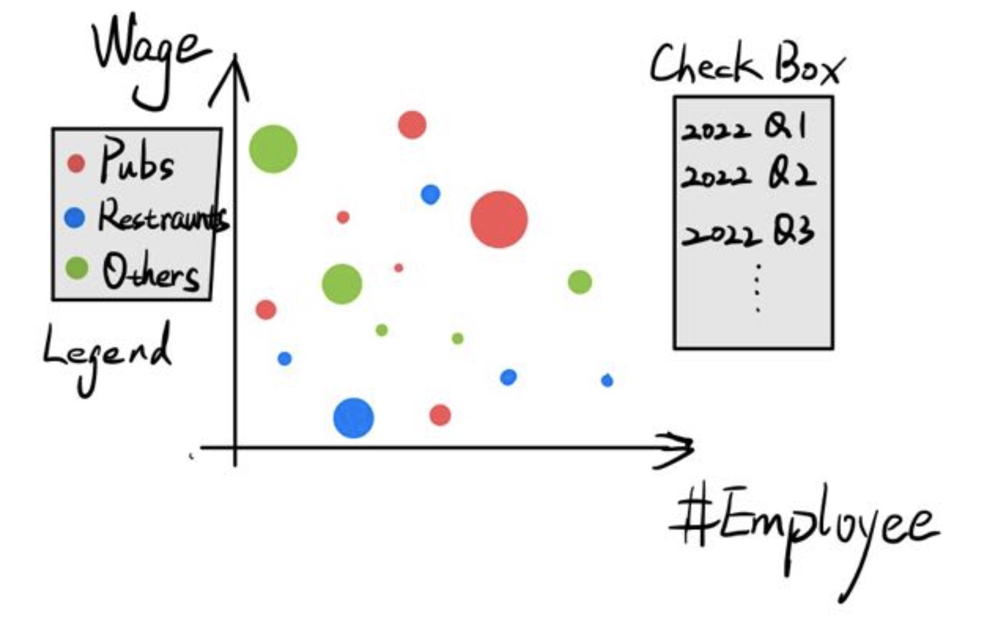
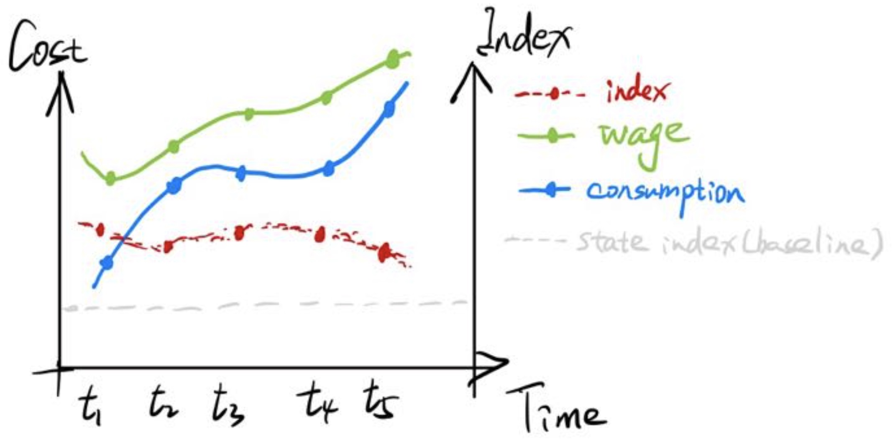
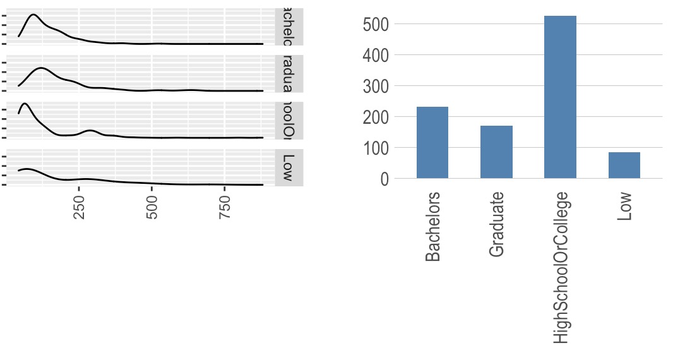
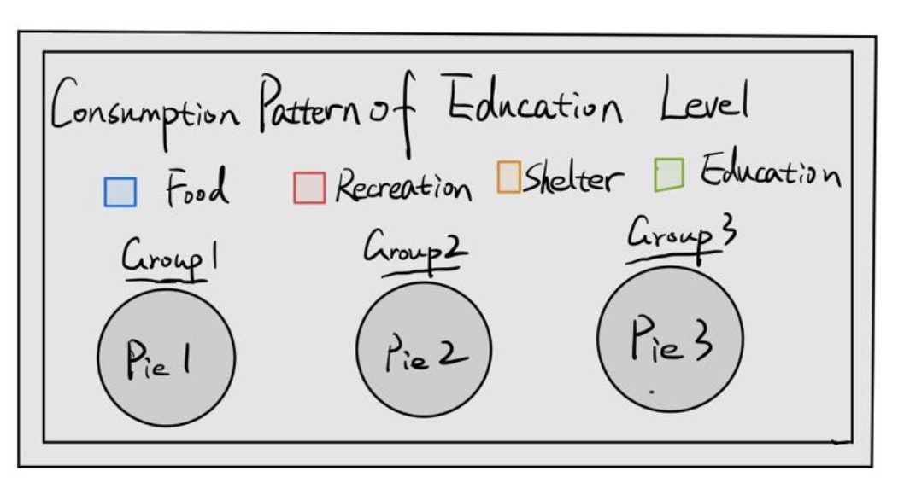
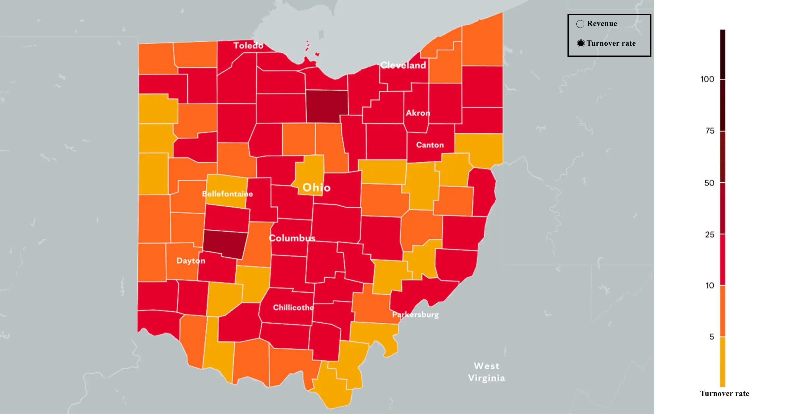
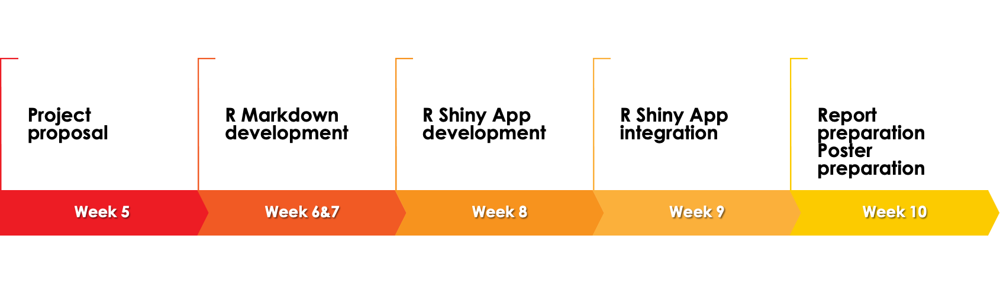

```{r setup, include=FALSE}
knitr::opts_chunk$set(echo = FALSE)
```


# Background 

Anticipating rapid growth, the city of Engagement, Ohio USA is doing a participatory urban planning exercise to understand the current state of the city and identify opportunities for future growth. About 1000 representative residents in this modest-sized city have agreed to provide data using the city’s urban planning app, which records the places they visit, their spending, and their purchases, among other things. From these volunteers, the city will have data to assist with their major community revitalization efforts, including how to allocate a very large city renewal grant they have recently received. Considering the financial status of Engagement’s businesses and residents, we need to use visual analytic techniques to address the financial health of the city. 

# Project Motivation 

Our project is motivated by providing financial insights for individuals and guidance for fiscal policy making of state Ohio. We will integrate various related data sources and inspect the information provided by participants over time to help answer the following questions: 

  - **Consumption Preference:** Is there any pattern for people’s consumption behavior?  

  - **Business Development:** Which businesses appear to be more prosperous or struggling? 

  - **Financial Health:** How does the financial health of the residents change over time? Are there groups that appear to exhibit similar patterns?

  - **Employer Health:** What employment patterns can be observed within the city limits? Are there any areas of particularly high or low turnover? 

# Data Description 

The data of our group project is the project dataset provided by the official 2022 VAST challenge. Here is the data download link: [https://bit.ly/VAST-Challenge-2022-data](https://bit.ly/VAST-Challenge-2022-data)

 - **`ParticipantStatusLogs<n>.csv`**: Record the living status of 1000 participants at every timestamp from March 1, 2022 to May 24, 2023.
 - **`Jobs.csv`**: Contains information about employment opportunities available in the city at the start of the study. Some of these jobs are held by participants at the start of the study, while others are open positions. 
 - **`Participants.csv`**: Contains geographical features and happiness index of the participants. 
 - **`Employers.csv`**: Records information about the companies within the city limits that either employ the participants, or have available job openings. 
 - **`Buildings.csv`**: Contains information about the commercial, residential and school buildings involved in this study. 
 - **`Pubs.csv`**: Contains locations and charging rates of the pubs within the city limits.

# Proposed Visualizations 

## Problem 1

Over the period covered by the dataset, which businesses appear to be more prosperous? Which appear to be struggling? Describe your rationale for your answers.

 - For each business(employer), plot its total employment and average hourly wage for different periods, and observe whether the business is growing or shrinking. 

<center>
  {height="100%" width="100%"}
</center>

## Problem 2

How does the financial health of the residents change over the period covered by the dataset? How do wages compare to the overall cost of living in Engagement? Are there groups that appear to exhibit similar patterns? Describe your rationale for your answers.

 - Financial health of a population can be evaluated by their saving rates, and the percentage of income they spend on fixed or non-discretionary expenses.
 - The wage and overall cost of living can be obtained from the daily activity logs. Engel's index can be calculated from these statistics. We plot these statistics for all participants with demographic attributes as facets and observe the patterns. 

<center>
  {height="100%" width="100%"}
</center>

 

<center>
  {height="100%" width="100%"}
</center>


<center>
  {height="100%" width="100%"}
</center>

## Problem 3

Describe the health of the various employers within the city limits. What employment patterns do you observe? Do you notice any areas of particularly high or low turnover? 

 -  Revenue serves as an indicator of the employer health, it can be calculated according to the daily activity logs of the participants and the hourly charging rate of the business.
 - Turnover is the number of transactions of a business. Plot the turnover for different employers  
 - Plot the revenue and turnover in the city map, and observe geospatial patterns. 

<center>
  {height="100%" width="100%"}
</center>

# Project Timeline 

<center>
  {height="100%" width="100%"}
</center>

# Software Tools & R Packages 

Our project will be done as an R Shiny application using RStudio as the IDE. We envision the use of the following packages:

 - Shiny – For creating an interactive R Shiny web-based application
 - tidyverse - Provides the fundamental packages for plotting(ggplot2), data cleaning and manipulation(dplyr, tidyr)
 - ggiraph: For making “ggplot” graphics interactive. 
 - plotly: For plotting interactive statistical graphs. 
 - DT: For creating interactive data table on html webpages.
 - ggdist: Provides a flexible set of ggplot2 geoms and stats designed especially for visualising distributions and uncertainty. 

# Github Repository 

The code for our project can be found at [github](https://github.com/AmazingDD/VA-Gallery)

# Team Members 

  - [Ding Yanmu](https://dingyanmu.netlify.app/) 
  - [Rao Ningzhen](https://jeanrao.netlify.app/) 
  - [Yu Di](https://yudiva.netlify.app/) 

# References 

 - Lyle, D. (2021, July 17). The 6 Best Ways to Measure Your Financial Health. Retrieved May 7, 2022 from [https://www.fool.com/the-ascent/banks/articles/the-6-best-ways-to-measure-your-financial-health/](https://www.fool.com/the-ascent/banks/articles/the-6-best-ways-to-measure-your-financial-health/)
 - Julia, K. (2022, April 10). Financial Health. Retrieved May 7, 2022 from [https://www.investopedia.com/terms/f/financial-health.asp](https://www.investopedia.com/terms/f/financial-health.asp)
 - The Consumer Financial Protection Bureau. (2015). 4 elements define personal financial well-being. Retrieved from: [https://www.consumerfinance.gov/about-us/blog/4-elements-define-personal-financial-well-being/](https://www.consumerfinance.gov/about-us/blog/4-elements-define-personal-financial-well-being/)
